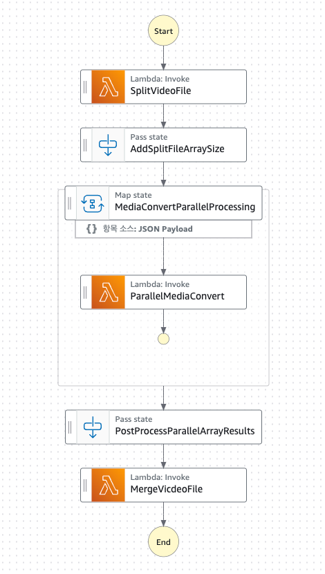
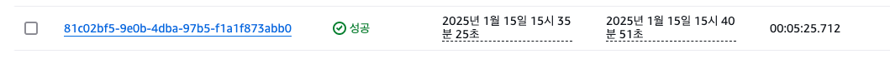

# AWS Step Functions
워크플로우의 작업(Task)으로 복잡한 비즈니스 로직을 오케스트레이션하는 기능입니다.  
여기서는 Lambda 함수 호출을 이용합니다.
## Media Convert
AWS Media Convert 서비스를 이용하여 동영상 인코딩 및 썸네일 추출 기능을 수행 하는 상태 머신 입니다.
### State Machine Graph

### Definition Code
```json
{
	"Comment": "A description of my state machine",
	"StartAt": "SplitVideoFile",
	"States": {
		"SplitVideoFile": {
			"Type": "Task",
			"Resource": "arn:aws:states:::lambda:invoke",
			"OutputPath": "$.Payload",
			"Parameters": {
				"FunctionName": "arn:aws:lambda:[region]:[AccountID]:function:splitVideoFile:$LATEST",
				"Payload": {
					"bucket.$": "$.bucket",
					"key.$": "$.key"
				}
			},
			"Retry": [
				{
					"ErrorEquals": [
						"Lambda.ServiceException",
						"Lambda.AWSLambdaException",
						"Lambda.SdkClientException",
						"Lambda.TooManyRequestsException"
					],
					"IntervalSeconds": 1,
					"MaxAttempts": 3,
					"BackoffRate": 2,
					"JitterStrategy": "FULL"
				}
			],
			"Next": "Map"
		},
		"Map": {
			"Type": "Map",
			"ItemProcessor": {
				"ProcessorConfig": {
					"Mode": "INLINE"
				},
				"StartAt": "ParallelMediaConvert",
				"States": {
					"ParallelMediaConvert": {
						"Type": "Task",
						"Resource": "arn:aws:states:::lambda:invoke",
						"Parameters": {
							"Payload": {
								"bucket.$": "$.bucket",
								"part.$": "$.part"
							},
							"FunctionName": "arn:aws:lambda:[region]:[AccountID]:function:ParallelMediaConvert:$LATEST"
						},
						"Retry": [
							{
								"ErrorEquals": [
									"Lambda.ServiceException",
									"Lambda.AWSLambdaException",
									"Lambda.SdkClientException",
									"Lambda.TooManyRequestsException"
								],
								"IntervalSeconds": 1,
								"MaxAttempts": 3,
								"BackoffRate": 2,
								"JitterStrategy": "FULL"
							}
						],
						"End": true,
						"ResultSelector": {
							"data.$": "$.Payload.data",
							"status.$": "$.Payload.status"
						},
						"OutputPath": "$.data"
					}
				}
			},
			"ItemsPath": "$.parts",
			"ItemSelector": {
				"bucket.$": "$.bucket",
				"part.$": "$$.Map.Item.Value"
			},
			"Next": "Pass"
		},
		"Pass": {
			"Type": "Pass",
			"Next": "MergeVicdeoFile",
			"InputPath": "$",
			"Parameters": {
				"originalFileName.$": "$[0].originalFileName",
				"bucket.$": "$[0].bucket",
				"encodedParts.$": "$[*].encodedPart"
			},
			"ResultPath": "$"
		},
		"MergeVicdeoFile": {
			"Type": "Task",
			"Resource": "arn:aws:states:::lambda:invoke",
			"OutputPath": "$.Payload",
			"Parameters": {
				"Payload.$": "$",
				"FunctionName": "arn:aws:lambda:[region]:[AccountID]:function:MergeVideoFile:$LATEST"
			},
			"Retry": [
				{
					"ErrorEquals": [
						"Lambda.ServiceException",
						"Lambda.AWSLambdaException",
						"Lambda.SdkClientException",
						"Lambda.TooManyRequestsException"
					],
					"IntervalSeconds": 1,
					"MaxAttempts": 3,
					"BackoffRate": 2,
					"JitterStrategy": "FULL"
				}
			],
			"End": true
		}
	},
	"QueryLanguage": "JSONPath"
}
```
### ffmpeg-layer
- ffmpeg 계층이 추가된 lambda함수:
```text
SplitVideoFile, MergeVideoFile
```
- 호환 런타임:
```text
python3.9, python3.10, python3.11, python3.12, provided.al2023
```

### Workflow
- **MediaConvertStateMachine-Start**
  - S3트리거 이벤트를 이용한 상태 머신 실행 함수
- **SplitVideoFile**
  -  환경변수에 정의된 `SegmentDuration` 값에 따라 파일 분할 및 S3 업로드
- **Map**
  - `SplitVideoFile` 상태에서 분할 된 파일 목록으로 각 파일마다 `ParallelMediaConvert` 함수를 병렬로 호출
- **ParallelMediaConvert**
  - `MP4` 인코딩 및 `Thumbnail` 추출 / S3 업로드
  - `Thumbnail`의 경우 분할된 파일중 첫번째 파일에서 추출 진행
- **Pass**
  - `Map` 상태에서 반환된 배열을 가공하여 `MergeVideoFile` 상태로 전달
- **MergeVideoFile**
  - 병렬로 처리 중인 `ParallelMediaConvert` 상태 완료 대기
  - 분할 된 파일 병합 후 최종 S3경로로 업로드

### Test Case
#### #1
- 조건
  - `SegmentDuration`: 300초
  - 용량: 3GB
- 결과

#### #2
- 조건
  - `SegmentDuration`: 60초
  - `#1` 동일
- 결과

#### #3
- 조건
  - `SegmentDuration`: 300초
  - 용량: 870MB
- 결과

#### #4
- 조건
  - `SegmentDuration`: 60초
  - `#3` 동일
- 결과

